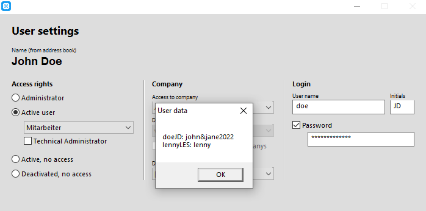

# Decrypting Revolver Office Passwords
[Revolver Office](https://www.revolver.info/) is a piece of software by a German software firm used by businesses to manage company data like customers, employees, projects, invoicing, inventory and more.
Their database contains user passwords encrypted using a static key (`2pAuzgX9Ns`) and a horribly insecure character-based [proprietary encryption algorithm](https://einhugur.com/Html/EcryptIt/EinhugurEncrypt.html).
Through reverse-engineering of the "Einhugur e-CryptItEngine" Xojo-Plugin (see [https://einhugur.com/Html/all.html](https://einhugur.com/Html/all.html)) it is possible to use the utility in this repository to decrypt the passwords back to their plaintext form.

## Extracting the encrypted passwords
To access the Revolver postgres database, follow [the instructions in  their documentation](https://hilfe.revolver.info/article/15tti80x73-serverdatenbankzugriff-intern-extern).
The `userlist` table contains the column `passw` containing the encrypted password as a base64 string.

## Decrypting passwords
To use the tools in this repository, first make sure you have [Rust and cargo](https://rustup.rs/) installed.

Then, in order to decrypt the encrypted base64 password string using the utility, run

    cargo run --release --bin decrypt_pass <BASE64PASSW>

where `<BASE64PASSW>` is the password from the database.

For example, we used the tool to decrypt the password of our John Doe test user like this:

    cargo run --release --bin decrypt_pass //iSKeMbs1FKC6o9Pw==

And the plaintext password `john&jane2022` appeared on the command line.

## Extracting passwords from the client of an admin user
Another, more convenient way to gather clear text passwords of users while only having access to an admin account.
The reason this works is because the encrypted passwords are known to the client of any admin user if the user edit window is opened.
To compile the application on Windows, run

    cargo build --release --bin client_extractor

Then, the exe can be found under `target/release/client_extractor.exe`.

To cross compile the exe under Linux, make sure you have `x86_64-w64-mingw32-gcc` installed and run:

    rustup target add x86_64-pc-windows-gnu
    cargo build --release --target x86_64-pc-windows-gnu --bin client_extractor 

Then, the exe can be found under `target/x86_64-pc-windows-gnu/release/client_extractor.exe`.

Now, to extract the user password of a user from an admin client, go to `File->Preferences->Administration->Users`, select a user from the list and click `Edit`.
Now launch the `client_extractor.exe` application alongside Revolver (it shouldn't need administrator privileges) and after a few seconds, a window like this should pop up, listing all users you clicked `Edit` on, including yourself, along with their plaintext passwords.

